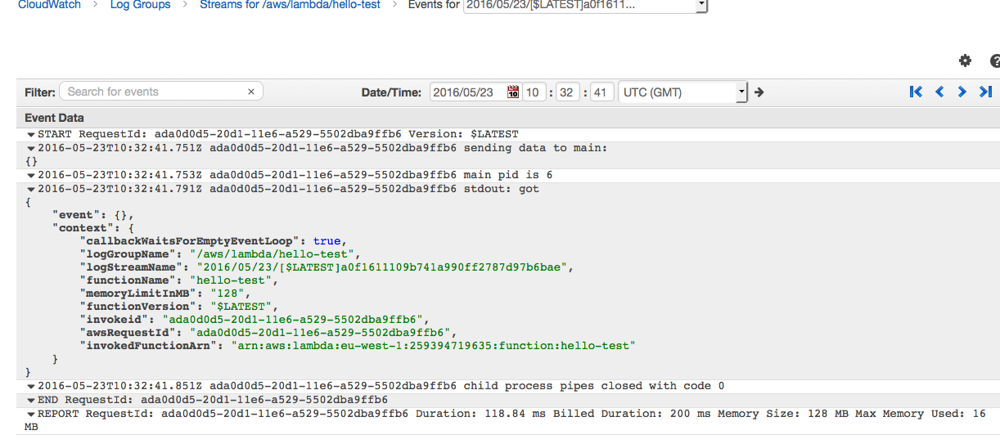

[](https://travis-ci.org/stilesb/haskell-serverless-example)

# haskell-serverless-example

**Haskell serverless example using AWS API Gateway and Lambda**

## Setup

### Requirements

* Vagrant or Docker (Engine and Compose)
* An AWS role for executing code on AWS Lambda, e.g., `arn:aws:iam::259394719635:role/lambda`

### Building


`main.hs` aims to automate the deployment of Haskell code packages to AWS Lambda:

```
$ vagrant up
$ vagrant ssh
$ aws configure # Follow prompt instructions
$ ./bin/setup
```

This generates a `lambda.zip` file in the current directory. Deploying an existing `lambda.zip` file to AWS:

```
$ ./bin/deploy
```

This creates function `foo` that can be invoked manually (see below).

Deleting an API Gateway endpoint:

```
$ ./bin/delete
```

Note that AWS has a rate limit on API deletions.

### TODO

* Create an API Gateway endpoint and link it to the AWS Lambda function. The configuration and part of the code are ready but the process is a little bit involved.

## Complex Build

A lot of interesting pieces of code rely on external C libraries. For example, [hmatrix](https://github.com/albertoruiz/hmatrix) relies on LAPACK and BLAS libraries for efficient matrix operations and compiled executable will need to be dynamically (or statically) linked to those libraries for proper execution. The above directions should be updated to take into account those extraneous libraries:

* Add the needed libraries into the build container description, e.g.

   ```
   RUN yum install -y lapack-devel blas-devel
   ```

* Build code as before, using the custom image,
* Export from container the needed libraries (the will be packed as part of the code shipped to AWS Lambda):

   ```
   $ docker run --volumes-from=$CONTAINER_ID haskell-centos ldd /build/.stack-work/install/x86_64-linux/ghc-7.10.3/7.10.3/bin/main > libs
   ... extract list of library files to copy...
   $ for i in $(cat libraryFiles); do
      docker run --volumes-from=$CONTAINER_ID haskell-centos dd if=$i > $(basename $i)
     done
   ```
* Modify the `run.js` wrapper to set correctly `LD_LIBRARY_PATH` environment:

   ```
   process.env['LD_LIBRARY_PATH'] = process.env['LAMBDA_TASK_ROOT']
   ctx = context
   ```
* Pack everything into `lambda.zip`: Javascript wrapper, libraries, executable...

## Deploy to AWS Lambda

* Create function on Lambda:

    ```
    $ aws lambda create-function --function-name hello-test --runtime nodejs4.3 --zip-file fileb://./aws-lambda.zip  --handler run.handle --role arn:aws:iam::259394719635:role/lambda
    {
        "CodeSha256": "QYKOebaDN/fqEzb1nmaV3ByNDZK3JvD0kWX6YQnPpjE=",
        "FunctionName": "hello-test",
        "CodeSize": 265356,
        "MemorySize": 128,
        "FunctionArn": "arn:aws:lambda:eu-west-1:259394719635:function:hello-test",
        "Version": "$LATEST",
        "Role": "arn:aws:iam::259394719635:role/lambda",
        "Timeout": 20,
        "LastModified": "2016-05-23T10:32:38.126+0000",
        "Handler": "run.handle",
        "Runtime": "nodejs4.3",
        "Description": ""
    }
    ```

* Run function on Lambda:

    ```
    $ aws lamdba invoke-function --function-name hello-test
    {
        "StatusCode": 200
    }
    $ cat test
    "child process exited with code 0"
    ```

The provided `main.hs` simply output its input to its output. There should be an execution trace in the logs hosted on CloudWatch:



## References

* [Inspiration](https://github.com/abailly/aws-lambda-haskell)
* [Running executables in AWS Lambda](http://aws.amazon.com/fr/blogs/compute/running-executables-in-aws-lambda/)
* [Child processes in node](https://nodejs.org/api/child_process.html)
* [AWS Lambda documentation](http://docs.aws.amazon.com/lambda/latest/dg/nodejs-create-deployment-pkg.html)
